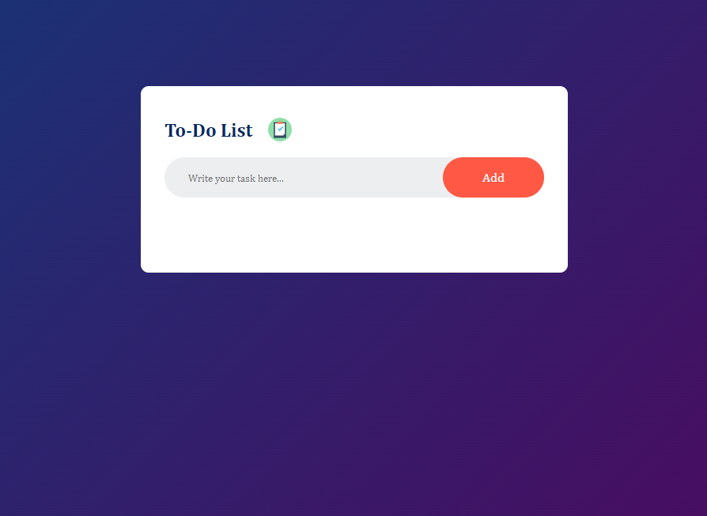
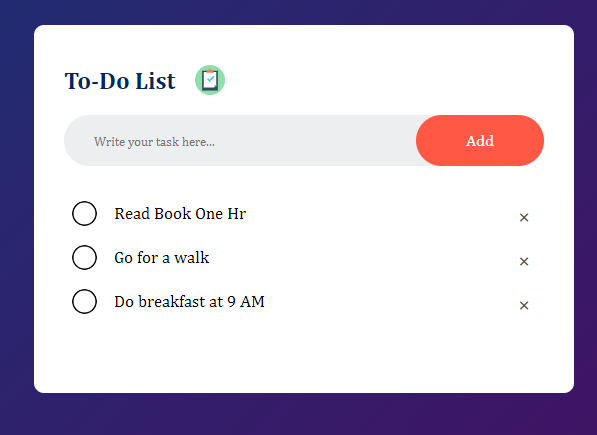
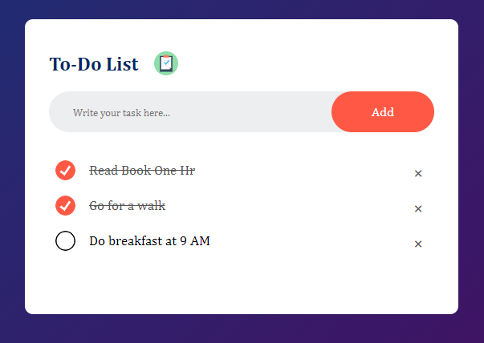

# ToDo - App

This is a simple ToDo list application built with HTML, CSS, and JQuery/JavaScript. It allows users to add and manage tasks in a list format.


## Getting Started

Clone the repository or download the project files.
Open the index.html file in a web browser.

```bash
  git clone https://github.com/DeepakKumarVermaRamgarh/ToDoApp
```
    
## Features

The "ToDo - App" provides a user interface where users can add tasks to a list, mark tasks as completed, and remove tasks from the list. The application stores the task data in the browser's local storage, allowing the tasks to persist across page reloads.

## Usage/Examples

- Upon opening the web page, the user interface displays a heading "To-Do List" along with an input box for entering tasks and an "Add" button.
- Enter a task in the input box and click the "Add" button to add it to the list.
- Click on a task in the list to mark it as completed. The completed task will have a strikethrough effect.
- Click on the "x" icon next to a task to remove it from the list.
- The application automatically saves the task list in the browser's local storage, allowing the tasks to persist even after closing the page or refreshing it.
- To clear the task list, you can clear the local storage by deleting the "todos" key in the browser's developer tools.


## Roadmap

Here is a brief overview of each file in the repository:

- index.html - This file contains the HTML code for the project.

- styles.css - This file contains the CSS code that styles the project.

- script.js - This file contains the JavaScript code.

- README.md - This file provides instructions on how to run the project.
## Authors

This project was created by Deepak Kumar Verma.
- [@DeepakKumarVermaRamgarh](https://github.com/DeepakKumarVermaRamgarh/)


## Screenshots




